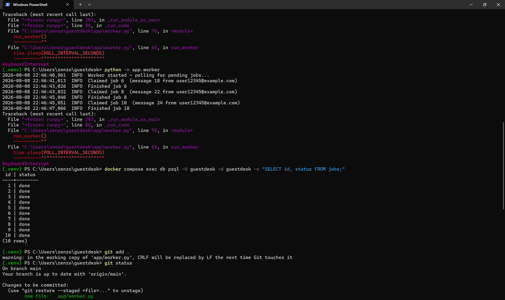
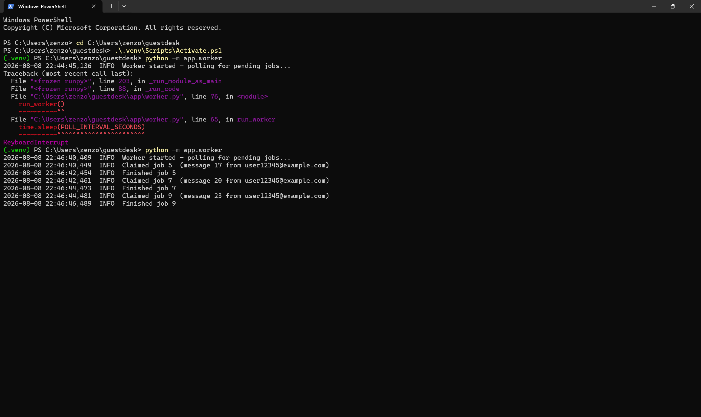
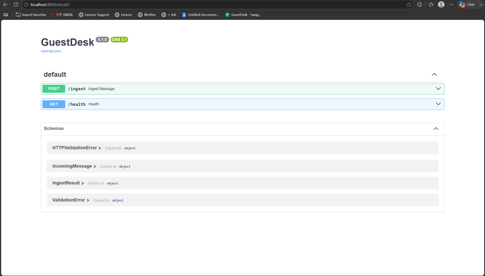
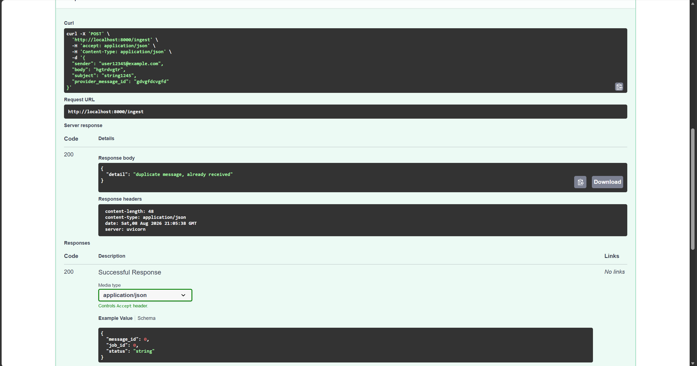

# guestdesk

A backend service that receives guest messages, stores them, queues background work, and allows multiple workers to process the queue concurrently.

Duplicate message deliveries are rejected through PostgreSQL uniqueness constraints, while workers use row-level locking to avoid claiming the same pending job at the same time.

Built with FastAPI, PostgreSQL, SQLAlchemy and Alembic, with a local Docker setup and a live cloud deployment on Render + Neon.




---

## The problem

A message-processing backend has a few problems that are easy to hide in a small demo.

The API should respond quickly even if the real work takes seconds. Message providers may deliver the same event more than once. And once multiple background workers are running, they must be able to consume the same queue without both claiming the same pending job.

The service separates those responsibilities:

```text
HTTP request
→ validate message
→ store message + create job
→ return response

                         ↓

                 background worker
                         ↓
                    claim job
                         ↓
                   process job
```

PostgreSQL is used both as the persistent store and as the job queue.

---

## Highlights

* **Database-level message deduplication.** `provider_message_id` and a SHA-256 content fingerprint are protected by independent PostgreSQL uniqueness constraints.
* **Concurrent queue consumption.** Workers claim pending jobs with `SELECT ... FOR UPDATE SKIP LOCKED`, allowing multiple workers to poll the same table without claiming the same pending row.
* **API and background processing are separate.** `POST /ingest` only validates and stores work; slow processing happens in a dedicated worker process.
* **Versioned database schema.** Tables and constraints are managed through Alembic migrations rather than manually-created database state.
* **Live cloud deployment.** The API runs on Render against managed PostgreSQL on Neon, while the same code can run locally against PostgreSQL 16 through Docker Compose.
* **Dependency-aware health check.** `/health` returns `503` when PostgreSQL cannot be reached instead of reporting the application as healthy regardless of its database state.

**Stack:** FastAPI · PostgreSQL 16 · SQLAlchemy 2 · Alembic · psycopg · Pydantic · Docker Compose · Render · Neon.



---

## How it works

### 1. Message ingestion

The entry point is:

```text
POST /ingest
```

Incoming JSON is validated with a Pydantic schema before it reaches the database.

A message contains:

* sender;
* optional subject;
* body;
* optional provider message ID.

The body must be non-empty and is limited to 50,000 characters. Sender validation uses an email field rather than accepting an arbitrary string.

For every accepted message, the ingest endpoint creates:

1. a `Message`;
2. an initial `Job` with status `pending`.

Both are committed together in the same database transaction.

The API can therefore accept work without performing the slow background operation during the HTTP request.

### 2. Duplicate detection

The service does not use the pattern:

```text
SELECT message
→ if it does not exist
→ INSERT message
```

because two concurrent requests can both perform the check before either insert commits.

Instead, duplicate detection is enforced when PostgreSQL writes the row.

The `messages` table has two uniqueness constraints:

```text
provider_message_id
content_hash
```

The provider ID handles the normal redelivery case when the upstream system sends the same message more than once with the same identifier.

The secondary fingerprint is calculated from:

```text
sender | subject | body
```

using SHA-256.

If either uniqueness constraint rejects the insert, the transaction is rolled back and the endpoint returns:

```json
{
  "detail": "duplicate message, already received"
}
```

This means concurrent inserts cannot both create the same message row merely because they reached the application at the same time.



### 3. PostgreSQL as the job queue

Jobs are stored in a normal PostgreSQL table.

The current job states allowed by the database are:

```text
pending
processing
done
failed
dead
```

A `CHECK` constraint rejects any other status.

Each job references its source message through a foreign key.

The relationship is intentionally one-to-many:

```text
Message
   │
   ├── Job
   ├── Job
   └── ...
```

The current ingest flow creates one initial processing job, but the data model does not require one job per message forever. A later version could attach separate classification, drafting, notification, or other jobs to the same stored message.

At the current scale, PostgreSQL is also enough for the queue itself, so the demo does not require Redis, RabbitMQ or another service.

### 4. Concurrent job claiming

The worker runs separately from the API and continuously looks for the oldest pending job.

The claim query uses:

```sql
SELECT ...
FROM jobs
WHERE status = 'pending'
ORDER BY created_at
LIMIT 1
FOR UPDATE SKIP LOCKED
```

When one worker selects a row, PostgreSQL locks it during the claim transaction.

Another worker polling at the same moment does not wait for that row. `SKIP LOCKED` makes it move past the locked job and look for another pending one.

The selected job is changed to:

```text
processing
```

and committed.

The worker then performs the job and eventually writes:

```text
done
```

The two screenshots at the top come from running two workers against the same queue and observing them claim different jobs.

The current `process_job()` implementation uses a short sleep as the placeholder for the slow operation. LLM classification and response drafting are not implemented in this repository yet.

---

## Database model

The core schema is intentionally small.

### `messages`

Stores the received message and its deduplication identifiers.

Relevant rules:

```text
PRIMARY KEY         id
UNIQUE              provider_message_id
UNIQUE              content_hash
```

### `jobs`

Stores work associated with a message.

Relevant fields include:

```text
id
message_id
status
attempts
created_at
updated_at
```

and:

```text
FOREIGN KEY message_id → messages.id
```

The database also restricts `status` to the known lifecycle values.

Schema changes are tracked through Alembic migrations so the same structure can be recreated locally or in another environment.

---

## Live deployment

The API is deployed on Render with PostgreSQL hosted on Neon.

Configuration is read from environment variables, so the database URL is not stored in the repository.

The same application code can therefore point to:

```text
local PostgreSQL
```

or:

```text
managed cloud PostgreSQL
```

without changing the Python source.

Database migrations are applied during deployment, and pushes to the deployment branch trigger a new application deployment.

The application also exposes:

```text
GET /health
```

which performs a real database query.

When PostgreSQL is reachable:

```json
{
  "status": "ok",
  "database": "ok"
}
```

When it is not reachable, the endpoint returns HTTP `503` and reports the application as degraded.

---

## Current failure behaviour

The current worker implements the basic lifecycle:

```text
pending
→ processing
→ done
```

If an exception happens inside the worker loop, the exception is logged and the current SQLAlchemy session is rolled back.

There is an important limitation here.

The transition to `processing` is committed before the slow work starts. If a worker dies after that commit but before the job reaches `done`, the current implementation does not automatically recover the stranded job.

The schema already includes:

```text
attempts
failed
dead
```

but retry policies and recovery logic are not wired into the worker yet.

So the current concurrency guarantee is specifically about **exclusive claiming of pending jobs**, not an exactly-once guarantee across arbitrary process crashes and retries.

---

## Limitations and possible improvements

### Worker recovery and retries

There is currently no reaper for jobs left in `processing` by a killed worker.

A later version could add:

* processing leases or timestamps;
* automatic retry with backoff;
* attempt counting;
* recovery of stale `processing` jobs;
* transition to `dead` after the retry budget is exhausted.

This would also require making downstream side effects idempotent if jobs can be retried.

### Content fingerprint scope

The secondary deduplication fingerprint uses:

```text
sender + subject + body
```

and its uniqueness is global.

That is useful for catching the same payload arriving with a different provider ID, but it also means two legitimate messages containing exactly the same values at different times would currently be treated as duplicates.

A production version could scope content-based deduplication to a time window or adapt the rule to the delivery semantics of the actual provider.

### Integrity error classification

The current ingest endpoint catches SQLAlchemy `IntegrityError` and treats it as a duplicate response.

That is sufficient for the current small schema and was left simple intentionally, but it does not inspect which database constraint actually failed.

A more defensive version would distinguish the known PostgreSQL uniqueness violations from unrelated integrity errors and surface unexpected failures separately.

### Authentication

`POST /ingest` is not currently protected by authentication.

For a real external integration, the endpoint could require an API key, signed webhook request, or provider-specific authentication before accepting messages.

### Queue scaling

PostgreSQL is enough for the current workload and keeps the number of services small.

At substantially higher throughput, queue access patterns could be indexed more specifically and eventually moved to a dedicated queue system if requirements such as scheduling, priorities, high fan-out, or more advanced retry semantics justified it.

### Automated tests

The repository does not currently include the integration test suite I would want before extending the worker lifecycle.

Useful cases would include:

* simultaneous duplicate ingest requests;
* duplicate content with different provider IDs;
* multiple workers draining the same queue;
* database failure during `/health`;
* worker crashes and stale-job recovery once that behaviour exists.

### Message processing

The actual message intelligence is intentionally outside the current scope.

Possible later stages include:

* intent classification;
* urgency detection;
* structured extraction;
* response drafting;
* retrieval from property documents;
* human-review workflows.

---

## Running the project

### Prerequisites

* Python;
* Docker;
* Docker Compose.

Start the local PostgreSQL database:

```bash
docker compose up -d
```

Create the environment file from the supplied example:

```bash
cp .env.example .env
```

The local database configuration uses PostgreSQL exposed on port `5433`.

Install the Python dependencies:

```bash
python -m venv .venv
pip install -r requirements.txt
```

Apply the database migrations:

```bash
alembic upgrade head
```

Start the FastAPI application:

```bash
uvicorn app.main:app --reload
```

The interactive API documentation is then available through FastAPI's `/docs` route.

Run a background worker in a separate terminal:

```bash
python -m app.worker
```

To test concurrent claiming, start the same worker command in a second terminal.

---

## Repository structure

```text
guestdesk/
├── alembic/
│   └── versions/
├── app/
│   ├── config.py
│   ├── db.py
│   ├── ingest.py
│   ├── main.py
│   ├── models.py
│   ├── schemas.py
│   └── worker.py
├── images_guestdesk/
├── .env.example
├── alembic.ini
├── docker-compose.yml
├── requirements.txt
└── README.md
```

Configuration values and database credentials are supplied through environment variables rather than committed into the application code.
